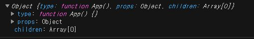
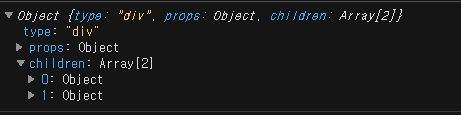

---
## 우아한 테크러닝 2주차-1
### 리액트 구조 파악하기
``` javascript
const list = [
    { title: "React에 대해 알아봅시다." },
    { title: "Redux에 대해 알아봅시다." },
    { title: "Typescript에 대해 알아봅시다." },
];

const rootElement = document.getElementById("root");

function app() {
    rootElement.innerHTML = `
        <ul>
            ${list.map((item) => `<li>${item.title}</li>`).join("")}
        </ul>
    `;
}

app();
```
바깥의 영향을 받지 않는 순수 함수로 만들어주기
``` javascript
function app(items) {
    rootElement.innerHTML = `
        <ul>
            ${items.map((item) => `<li>${item.title}</li>`).join("")}
        </ul>
    `;
}

app(list);
```
특정 데이터를 어떠한 형태(app)로 어디(rootElement)에 그려주는 과정을 웹앱이라고 한다.  
app() 직접 DOM에 접근해 구조를 변경하고 있다. DOM에 직접 접근하는 것은 규모가 커지면 복잡해질 수 있기때문에 사용하지 않는 것이 좋다.  
RealDOM으로 하면 안정성이 떨어지고 추상적이지 못하며 복잡도가 올라간다 -> 수정에 유용하지 않다!  
이러한 이유로 Virtual DOM 형태의 라이브러리들이 개발되었다.  

### React 이해하기
> <h1> </h1> 같은 html은 문자열이기 때문에 다루기 까다로운 구조이다. 그래서 다루기 쉬운 구조로 변환 시켜줘야하는데 그게 DOM Tree 중간 다루기 쉬운 포멧으로 만들면 다루기 훨씬 쉽다  
> DOM - VirtualDOM -JS 도 마찬가지로 DOM은 복잡하고 이를 JS가 다루기 어려우니 중간에 VirtualDOM을 둔다.  
> VirtualDOM은 realDOM, JS 둘다 잘알고 있어서 상태 유지 할수 있는 구조가 된다.  
> 또한 사용성에 용이하게 하기 위해 jsx를 만들었고 이를 babel로 트랜스파일링 한다.  

``` javascript
import React from "react";
import ReactDOM from "react-dom";

function App() {
    return (
        <div>
            <h1>Hello?</h1>
            <ul>
                <li>React</li>
                <li>Redux</li>
                <li>MobX</li>
                <li>Typescript</li>
            </ul>
        </div>
    );
}

ReactDOM.render(<App />, document.getElementById("root"));
```
ReactDOM은 render라는 정적메서드를 가지며 2개의 인자를 받는다.  
첫번째 인자는 화면에 렌더링할 컴포넌트, 두번째는 컴포넌트를 렌더링할 요소  
``` javascript
import React from "react";
import ReactDOM from "react-dom";

function StudyList() {
    return (
        <ul>
            <li>React</li>
            <li>Redux</li>
            <li>MobX</li>
            <li>Typescript</li>
        </ul>
    );
}

function App() {
    return (
        <div>
            <h1>Hello?</h1>
            <StudyList />
        </div>
    );
}

ReactDOM.render(<App />, document.getElementById("root"));
```
App 내부에 있던 ul 컴포넌트를 StudyList 함수로 만들어서 분리하니까 코드 관리하기가 더 쉬워졌다.  
``` javascript
function StudyList() {
    return (
        <ul>
            <li className="item">React</li>
            <li className="item">Redux</li>
            <li className="item">MobX</li>
            <li className="item">Typescript</li>
        </ul>
    );
}
```
위의 코드들을 VirtualDOM으로 바꿔서 표현하면 이렇게 변한다.  
```javascript
const vdom = {
    type: "ul",
    props: {},
    children: [
        { type: "li", props: { className: "item" }, children: "React" },
        { type: "li", props: { className: "item" }, children: "Redux" },
        { type: "li", props: { className: "item" }, children: "Typescript" },
        { type: "li", props: { className: "item" }, children: "MobX" },
    ],
};
```
studyList는 이런식으로 변한다.  
``` javascript
function StudyList(props) {
    return (
        <ul>
            <li className="item">React</li>
            <li className="item">Redux</li>
            <li className="item">MobX</li>
            <li className="item">Typescript</li>
        </ul>
    );
}

function App() {
    return (
        <div>
            <h1>Hello?</h1>
            <StudyList item="abcd" id="hoho" />
        </div>
    );
}
```
``` javascript
const vdom = {
    type: "ul",
    props: { item: "abcd", id: "hoho" },
    children: [
        { type: "li", props: { className: "item" }, children: "React" },
        { type: "li", props: { className: "item" }, children: "Redux" },
        { type: "li", props: { className: "item" }, children: "Typescript" },
        { type: "li", props: { className: "item" }, children: "MobX" },
    ],
};
```
### React 만들기
* createElement 함수  
``` type ```은 HTML 태그의 type  
```props``` 는 컴포넌트 속성  
```children```은 자식 노드(배열)  
가상돔을 만드는 역할을 하며 jsx 형태로 만들어 babel에서 컴파일 해준다.  
``` javascript
function createElement(type, props, ...children) {
  return { type, props, ...children };
}
```
``` javascript
const vdom = createElement("ul", {}, createElement("li", {}, "React"));
```
virtualDOM 객체와 createElement 함수로 만들어진 결과  
``` javascript
/* @jsx createElement */

function createElement(type, props = {}, ...children) {
  return { type, props, children };
}

...

console.log(<App />);
```
이때 출력 결과물이 아래 같이 출력된다.  

```createElement``` 함수의 첫번쨰 인자인 type이 function App(){}으로 표현된다.  
``` javascript
function createElement(type, props = {}, ...children) {
    if (typeof type === "function") {
        return type.apply(null, [props, ...children]);
    }

    return { type, props, children };
}
```
type 매개 변수 타입을 확인하는 로직 추가하면 된다.  
type이 함수일 경우 apply를 이용해 기존의 매개변수를 그대로 넣어 호출한다.  

* App.js  
``` javascript
/* @jsx createElement */
import { createElement, render } from './react';

function Hello(props) {
  return <li className="item">{props.label}</li>;
}

function App() {
  return (
    <div>
      <h1>Hello World</h1>
      <ul className="board" onClick={() => null}>
        <Hello label="Hello" />
        <Hello label="World" />
        <Hello label="React" />
      </ul>
    </div>
  );
}

render(<App />, document.getElementById("root));
```
* react.js  
재귀함수 이용해 node 타입이 문자열 될 때까지 반복해 생성하게 된다.  
``` javascript
function renderElement(node) {
  if (typeof node === 'string') {
    return document.createTextNode(node);
  }

  const el = document.createElement(node.type);

  node.childern.map(renderElement).forEach(element => {
    el.appendChild(element);
  }); // node 는 Tree 형태이기에 재귀 호출이 필요, children 이 있으면 ? tree 형태의 자식 node 를 만들 것.
  return el;
}

export function render(vdom, container) {
  // 실제 이 영역에서 vdom 과 비교해서 바뀐 경우만 렌더링하는 역할도 포함되어있을 것

  container.appendChild(renderElement(vdom));
  // container.appendChild(el) <- render 에서 return 된 el 이 여기에 들어가는 것.
}

export function createElement(type, props, ...children) {
  if (typeof type === 'function') {
    return type.apply(null, [props, ...children]); // children 의 타입이 배열이므로 apply 를 써야한다.
  }
  return { type, props, children };
}

```
최상단에 ```/* @jsx createElement */ ``` 넣어주면 babel로 트랜스파일링 되는 vdom 역할 준다 (트랜스파일러 역할)  
jsx 문법 찾아서 자동으로 변환해줌  
jsx -> createElement로 바꿔준다.  
어떤게 컴파일 타임인지 런타임에 일어나는건지 인지할 수 있어야함  
``` javascript
/* @jsx createElement */

// ...
```

### React 컴포넌트와 상태 관리
* 클래스 컴포넌트  
클래스 컴포넌트는 라이클 사이클(필요한 부분만 호출하려고)이 존재하며 생성자에서 초기화할 수 있다.  
``` javascript
class Hello extends React.Component {
    constructor(props) {
        super(props);   //상태를 초기화

        this.state = {
            count: 1,
        };
    }

    componentDidMount() {
        this.setState({ count: this.state.count + 1 });
    }

    render() {
        return <p>안녕하세요!</p>;
    }
}
const hello = new Hello();
hello.render() // 리액트가 밖에서 불러 class 내부에서 부를 일 없다.
```
상태 변경하기 위해 setState 메서드 이용한다.  
클래스 컴포넌트으 ㅣ상태는 객체의 생성자에 초기화되기 때문에 React가 지우지 않는 이상 유지된다.  
요즘에는 js proxy 스팩 이용해서 데이터 변화 감지할 수 있지만 에전에는 없었어서 setState 해줬다.  
* 함수형 컴포넌트  
초기의 상태를 갖기 못하는 컴포넌트로 여겨졌다.  
함수 컴포넌트의 상태는 함수가 호출될때마다 생성되기 때문에 유지할 수 없었기 때문이다.  
함수형은 호출, 업데이트 이런것만 가능하다. 이와 같은 구조로 라이프 사이클도 가질 수 없었다.  
``` javascript
function App() {
    let x = 10;
    return (
        <div>
            <h1>상태</h1>
            <Hello />
        </div>
    );
}
```
** Hook *** 이 등장하면서 상태 관리 가능해짐  
``` javascript
import React, { useState } from "react";

function App() {
    const [count, setCount] = useState(1);

    return (
        <div>
            <h1>상태</h1>
            <Hello />
        </div>
    );
}
```
useState 반환 첫번째는 상태값, 두번째는 ```dispatcher```로 사용되는 함수이다  
[1,function bound dispatchAction()] 이런식으로  

* hook의 매커니즘  
hook은 전역 배열로 관리되며 생성되는 순서에 따라 컴포넌트를 ```key```로 하여 인덱스로 관리한다.  
만약 배열에 아무 정보도 없을 경우 초기값 저장(useState의 value) , 값련 정보가 있을 경우 기존의 상태가 저장되어 있기 때문에 그 배열 내부 인덱스 를 참조한다.  
함수형 컴포넌트 내에서만 호출되어야 하고 conditional하게 호출하면 index를 참조하지 못한다. 컴포넌트가 렌더링 된 순서대로 훅을 호출하는 이유이다.  
*최상위(at the Top Level)에서만 Hook을 호출해야 합니다. * 라는 [hook 규칙](https://ko.reactjs.org/docs/hooks-rules.html)도 이 이유에서 작성되었다.  
최상위가 아닌 부분에서 호출될 경우 전역 배열에 문제가 생겨 원하지 않는 값을 반환하는 경우가 생길수도있다.  


